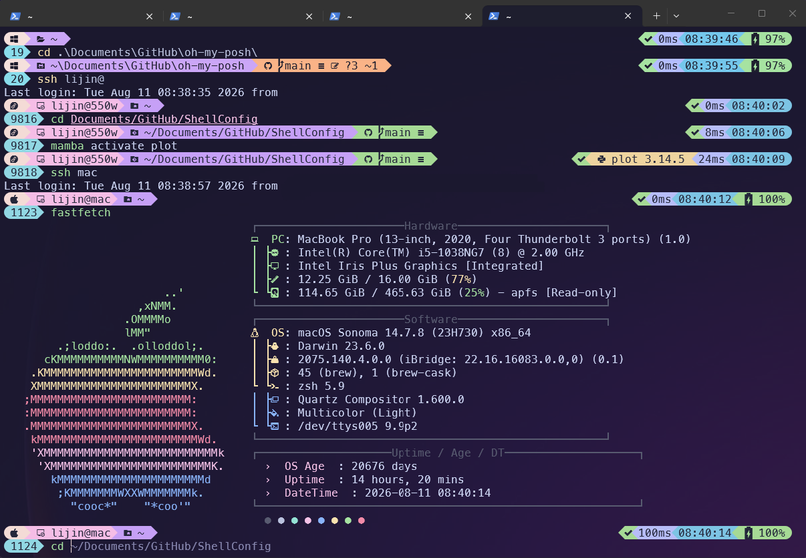

Language: English 🇺🇸 | 语言[中文🇨🇳](./README.zh-cn.md)

# ShellConfig

> A polished, portable shell environment for macOS, Linux, Windows, and NixOS.



ShellConfig brings together a carefully designed [Oh My Posh](https://ohmyposh.dev/)
prompt, practical Zsh defaults, optional plugins, and a separate LazyVim setup.
The configuration is shared where it should be shared—and remains local where
your machine and tools need room to customize it.

## Why Jinli?

The Koi-fish (锦鲤) theme [`jinli.omp.json`](./jinli.omp.json) is designed to make
useful context visible without turning the prompt into noise:

| Feature | What it shows |
| --- | --- |
| **Context-aware path** | Home, locked, GitHub, Git, npm, Downloads, Pictures, and ordinary folders each get a meaningful icon. |
| **Git at a glance** | Repository name, branch, worktree state, and change counts. |
| **Language-aware status** | Python and Node versions appear only when relevant to the current project. |
| **Remote-session awareness** | SSH sessions are marked with a remote icon so local and remote shells are easy to distinguish. |
| **Responsive segments** | Battery, time, execution duration, and exit status adapt to the environment and stay aligned to the right. |
| **Cross-platform design** | Zsh on macOS/Linux, PowerShell on Windows, and declarative NixOS support. |

The screenshot above also shows the theme working alongside the optional system
information display used in this repository’s broader shell setup.

## Install

Choose the setup for your platform. Run installers as your normal user; they
ask before using `sudo` when a system package is required.

### macOS or Linux

On macOS, install [Homebrew](https://brew.sh/) first. Then run:

```sh
curl -fsSLO https://raw.githubusercontent.com/jin-li/ShellConfig/main/install-oh-my-posh.sh
chmod +x install-oh-my-posh.sh
./install-oh-my-posh.sh
```

The installer asks where to clone the repository. Press Enter for
`~/Documents/GitHub/ShellConfig`, or enter another directory. When it finishes,
restart the terminal or run `exec zsh`.

To update an existing installation, run the updater from the repository itself:

```sh
cd /path/to/ShellConfig
./update.sh
```

### Windows PowerShell

Open PowerShell as your normal user:

```powershell
Set-ExecutionPolicy -Scope Process Bypass
Invoke-WebRequest https://raw.githubusercontent.com/jin-li/ShellConfig/main/install-oh-my-posh.ps1 -OutFile install-oh-my-posh.ps1
.\install-oh-my-posh.ps1
```

The installer uses WinGet when it needs Oh My Posh or Git, asks for the
repository location, and preserves existing PowerShell profile content.

### NixOS

Add the repository as a flake input, import the module, and enable it:

```nix
inputs.shell-config.url = "github:jin-li/ShellConfig";

modules = [ inputs.shell-config.nixosModules.default ];
programs.shellConfig.enable = true;
users.users.<username>.shell = pkgs.zsh;
```

Then rebuild and start a fresh Zsh session:

```bash
sudo nixos-rebuild switch --flake .#<host>
exec zsh
```

## Fonts and terminal setup

Install and select **MesloLGM Nerd Font** in your terminal profile. The prompt
uses Nerd Font glyphs for its icons; without the font, icons may appear as
boxes. For WSL, run the Linux installer inside WSL but install the font on
Windows.

## Shell configuration

The shared shell configuration uses Zsh on macOS/Linux and PowerShell on
Windows. Zsh includes:

- [zsh-autosuggestions](https://github.com/zsh-users/zsh-autosuggestions)
- [fast-syntax-highlighting](https://github.com/zdharma-continuum/fast-syntax-highlighting)
- Case-insensitive completion, including convenient directory completion
- A directory stack via `AUTO_PUSHD`, `PUSHD_IGNORE_DUPS`, `cd -<number>`, and `dirs -v`

Homebrew, Oh My Zsh, and Neovim are optional. `.zshrc.common` enables optional
integrations only when the relevant program is available. If Oh My Zsh exists,
the installer uses its custom plugin directory; otherwise plugins go under
`~/.local/share/zsh/plugins`.

## Shared and local Zsh configuration

The repository’s [`.zshrc.common`](./.zshrc.common) is the stable, shared
configuration. The installer creates a regular `~/.zshrc` that sources it.
Machine-specific settings and tool initialization belong in `~/.zshrc`, so
Conda, OpenClaw, and similar tools can add their setup without changing the
shared repository file.

```zsh
export PATH="$HOME/.local/bin:$PATH"
alias connect-hpc='ssh user@example.org'
```

Existing `~/.zshrc.local` files are still sourced for backward compatibility.
The installer backs up an existing `~/.zshrc` as
`~/.zshrc-pre-oh-my-posh-jinli` (with a timestamp if needed).

## Neovim setup

LazyVim is intentionally separate from shell installation:

```sh
curl -fsSLO https://raw.githubusercontent.com/jin-li/ShellConfig/main/install_LazyVim.sh
chmod +x install_LazyVim.sh
./install_LazyVim.sh
```

The current LazyVim starter requires Neovim 0.11.2 or newer. The installer backs
up existing Neovim data before cloning the starter. The first `nvim` launch
downloads plugins; run `:checkhealth` afterward.

## Installation reference

The macOS/Linux installer installs Zsh dependencies and Oh My Posh, clones or
updates the repository, installs the two Zsh plugins, links the theme to
`~/.config/oh-my-posh/jinli.omp.json`, and offers to install Meslo Nerd Font.
It also adds Oh My Posh’s executable directory to the user-managed `~/.zshrc`
when necessary, before `.zshrc.common` is loaded.

On HPC systems, it can build ncurses and Zsh under `~/.local` (or
`$SHELL_CONFIG_PREFIX`) when `sudo` is unavailable and only Zsh is missing.
The compiler and `make` must already be available, for example through cluster
modules.

After installation, the main files are:

| Purpose | Location |
| --- | --- |
| Repository | `~/Documents/GitHub/ShellConfig` or the directory you selected |
| Shared Zsh configuration | Repository [`.zshrc.common`](./.zshrc.common) |
| Local Zsh configuration | `~/.zshrc` |
| Oh My Posh theme | `~/.config/oh-my-posh/jinli.omp.json` |
| Standalone Zsh plugins | `~/.local/share/zsh/plugins` |
| LazyVim configuration | `~/.config/nvim` |

Windows uses the theme directly from the repository and updates only its
managed Oh My Posh block in `$PROFILE`; it does not create a `~/.config` theme
link. The NixOS module manages the shared configuration declaratively but does
not manage the user’s `~/.zshrc`.
