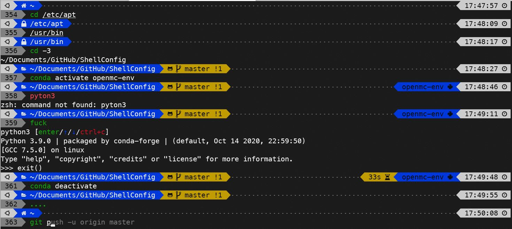
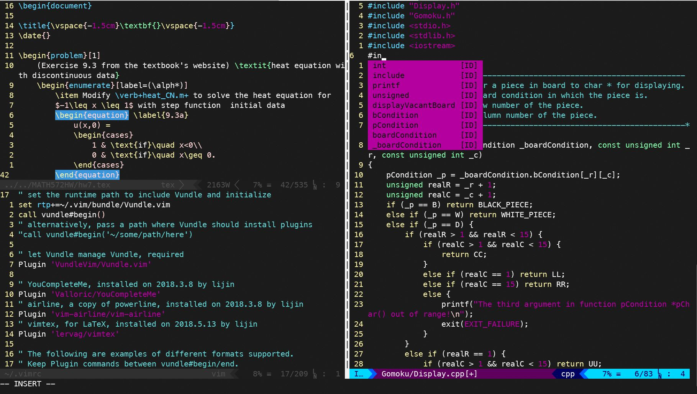

语言 : 🇨🇳 | [🇺🇸](./README.md)

## 配置shell

效果展示:



### 特点

- Shell: oh-my-zsh
- 主题: powerlevel10k
- 插件: 命令自动补全建议[zsh-autosuggestions](https://github.com/zsh-users/zsh-autosuggestions), 命令语法高亮[zsh-syntax-highlighting](https://github.com/zsh-users/zsh-syntax-highlighting), 命令修正建议[thefuck](https://github.com/nvbn/thefuck)

### 安装

1. 安装 Meslo Nerd 字体
   
   下载一下四个字体文件：

    - [MesloLGS NF Regular.ttf](https://github.com/romkatv/powerlevel10k-media/raw/master/MesloLGS%20NF%20Regular.ttf)
    - [MesloLGS NF Bold.ttf](https://github.com/romkatv/powerlevel10k-media/raw/master/MesloLGS%20NF%20Bold.ttf)
    - [MesloLGS NF Italic.ttf](https://github.com/romkatv/powerlevel10k-media/raw/master/MesloLGS%20NF%20Italic.ttf)
    - [MesloLGS NF Bold Italic.ttf](https://github.com/romkatv/powerlevel10k-media/raw/master/MesloLGS%20NF%20Bold%20Italic.ttf)

    双击各文件并点击`安装`按钮，然后电脑上包括命令行终端在内的的各个软件就可以使用`MesloLGS NF`字体了。

    请参考[p10k Font](https://github.com/romkatv/powerlevel10k#Fonts)来为Windows Power Shell、macOS Terminal等命令行终端工具配置`MesloLGS NF`字体。

1. 更新 `apt` 源
    ```bash
    sudo apt update
    ```

1. 安装依赖的工具库 (*git*, *wget*, *python3*, *pip3*)
   
    ```
    sudo apt install wget git python3-dev python3-pip python3-setuptools
    ```

1. [安装zsh](https://github.com/ohmyzsh/ohmyzsh/wiki/Installing-ZSH)
    
    - Ubuntu, Debian 及Debian系衍生系统
        ```
        sudo apt install zsh
        ```

    - Arch Linux 或 Manjaro
        ```
        sudo pacman -S zsh
        ```
    
    - macOS已自带zsh

1. 通过*wget*安装 [oh-my-zsh](https://github.com/ohmyzsh/ohmyzsh)
    
    ```
    sh -c "$(wget -O- https://raw.githubusercontent.com/ohmyzsh/ohmyzsh/master/tools/install.sh)"
    ```

1. 安装 [powerlevel10k](https://github.com/romkatv/powerlevel10k#oh-my-zsh)
   
    ```
    git clone --depth=1 https://github.com/romkatv/powerlevel10k.git ${ZSH_CUSTOM:-$HOME/.oh-my-zsh/custom}/themes/powerlevel10k
    ```

1. 安装插件和工具
   
    - 命令自动补全建议zsh-autosuggestions
        ```
        git clone https://github.com/zsh-users/zsh-autosuggestions ${ZSH_CUSTOM:-~/.oh-my-zsh/custom}/plugins/zsh-autosuggestions
        ```
    - 命令语法高亮zsh-syntax-highlighting
        ```
        git clone https://github.com/zsh-users/zsh-syntax-highlighting.git ${ZSH_CUSTOM:-~/.oh-my-zsh/custom}/plugins/zsh-syntax-highlighting
        ```
    - 命令修正建议thefuck
        ```
        sudo pip3 install thefuck
        ```

1. 下载配置文件，并链接到用户根目录下
    
    1. 从GitHub下载 *ShellConfig*
        ```
        mkdir -p ~/Documents/GitHub
        cd ~/Documents/GitHub
        git clone https://github.com/jin-li/ShellConfig.git 
        ```
    2. 备份旧配置文件
        ```
        mv ~/.bashrc ~/.bashrc_bak
        mv ~/.zshrc ~/.zshrc_bak
        ```
    3.将配置文件链接到 *home* 目录
        ```
        ln ~/Documents/GitHub/ShellConfig/.bashrc ~/.bashrc
        ln ~/Documents/GitHub/ShellConfig/.zshrc ~/.zshrc
        ln ~/Documents/GitHub/ShellConfig/.p10k.zsh ~/.p10k.zsh
        ```

1. 重启命令行终端

## 配置Vim



### 特点

- 使用*Vundle*作为插件管理工具
- 主题: vim-airline
- 插件: 自动补全工具[YouCompleteMe](https://github.com/ycm-core/YouCompleteMe), 主题[vim-airline](https://github.com/vim-airline/vim-airline), TeX插件[vimtex](https://github.com/lervag/vimtex)

### 前提

Debian系统默认的*vim*版本是不支持插件功能的*vim-tiny*。运行如下命令可核对你的*vim*版本：

```
vi --version
```

若命令输出显示"Small version without GUI"，则意味着你电脑上的 *vim* 是 *vim-tiny*。你可以使用如下命令安装正常完整版本的*vim*：

```
sudo apt remove vim-tiny
sudo apt install vim
```

### 配置

1. 安装 [Vundle](https://github.com/VundleVim/Vundle.vim)

    ```
    git clone https://github.com/VundleVim/Vundle.vim.git ~/.vim/bundle/Vundle.vim
    ```

2. 链接配置文件到 *home* 目录
    ```
    ln ~/Documents/GitHub/ShellConfig/.vimrc ~/.vimrc
    ```

3. 在*vim*内安装插件。在*vim*命令模式下运行下面的命令：
    ```
    :PluginInstall
    ```
    由于在配置文件中已经声明了这些插件，所以输入上述命令并敲击回车键后这些插件会自动开始安装，可能需要数秒到数分钟来完成安装。

1. 也可以通过 *Vundle* 安装其他插件。
